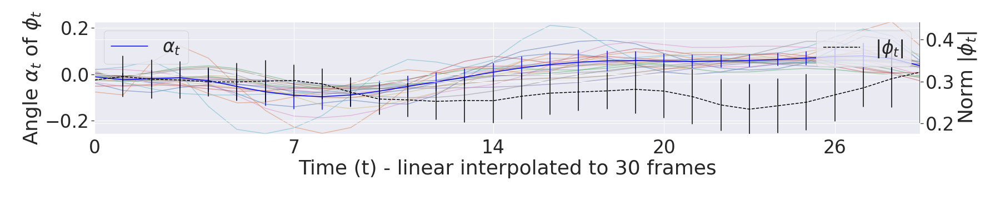

Self-Supervised Phase Detection Framework for CMR Images
==============================

This repository contains code to train several **self-Supervised Cardiac Phase Detection** models on 4D cardiac magnetic resonance (CMR) cine images.
This repository was used for the following paper:
**Self-supervised motion descriptor for cardiac phase detection in 4D CMR based on discrete vetor field estimation**.

For a more detailed description, a model definition and further results we refer to our [paper](#paper).

Please note: this is an ongoing repository, while paper creation we worked with the following code version:
commit: 2b77177c469531497a7aa9d9217504284053f7a9

# Motivation

## How can we derive knowledge about the cardiac phases from CMR without access to any label?


In this work, we show how to efficiently reduce a 3D+t deformable vector
field into a 1D motion descriptor representing the general dynamic pattern of a
cardiac cycle in a self-supervised manner. We evaluate the plausibility
of this motion descriptor and apply it to the task of cardiac phase detection. Here,
we define a rule-set based on the expected cardiovascular physiological properties
of a contracting/relaxing ventricle and extract the ED/ES phase at the turning
point of deformation. To verify the plausibility of the motion descriptor in the
intermediate frames, we further extend this rule-set to extract three additional
physiologically relevant time points (cf. Sec. 4 of our paper) and compare them with clinical
labels from an experienced pediatric cardiologist on two heterogeneous cohorts.

------------


This Readme covers the following topics:
- [Motivation](#motivation)
- [Cite and Paper](#paper)
- [Abstract](#abstract)
- [Poster](#poster)
- [Code and Repo Overview](#project-overview)
- [Dataset description](#datasets)
- [Trainings scripts](#training)
- [Prediction scripts](#prediction)
- [Evaluation scripts and dataframe description](#evaluation)
- [Setup instructions](#setup)


# Paper

Please cite the following paper (accepted for the STACOM Workshop @ MICCAI2022) if you use/modify or adapt parts of this repository:

[Lab](https://ukhd.de/aicm)
[Arxiv](https://arxiv.org/abs/2209.05778)
[Paper](https://link.springer.com/chapter/10.1007/978-3-031-23443-9_7)
[Complete Proceeding](https://link.springer.com/book/10.1007/978-3-031-23443-9)
[DOI](https://doi.org/10.1007/978-3-031-23443-9)

## Bibtext

    @InProceedings{10.1007/978-3-031-23443-9_7,
      author="Koehler, Sven
      and Hussain, Tarique
      and Hussain, Hamza
      and Young, Daniel
      and Sarikouch, Samir
      and Pickardt, Thomas
      and Greil, Gerald
      and Engelhardt, Sandy",
      editor="Camara, Oscar
      and Puyol-Ant{\'o}n, Esther
      and Qin, Chen
      and Sermesant, Maxime
      and Suinesiaputra, Avan
      and Wang, Shuo
      and Young, Alistair",
      title="Self-supervised Motion Descriptor for Cardiac Phase Detection in 4D CMR Based on Discrete Vector Field Estimations",
      booktitle="Statistical Atlases and Computational Models of the Heart. Regular and CMRxMotion Challenge Papers",
      year="2022",
      publisher="Springer Nature Switzerland",
      address="Cham",
      pages="65--78",
      abstract="Cardiac magnetic resonance (CMR) sequences visualise the cardiac function voxel-wise over time. Simultaneously, deep learning-based deformable image registration is able to estimate discrete vector fields which warp one time step of a CMR sequence to the following in a self-supervised manner. However, despite the rich source of information included in these 3D+t vector fields, a standardised interpretation is challenging and the clinical applications remain limited so far. In this work, we show how to efficiently use a deformable vector field to describe the underlying dynamic process of a cardiac cycle in form of a derived 1D motion descriptor. Additionally, based on the expected cardiovascular physiological properties of a contracting or relaxing ventricle, we define a set of rules that enables the identification of five cardiovascular phases including the end-systole (ES) and end-diastole (ED) without usage of labels. We evaluate the plausibility of the motion descriptor on two challenging multi-disease, -center, -scanner short-axis CMR datasets. First, by reporting quantitative measures such as the periodic frame difference for the extracted phases. Second, by comparing qualitatively the general pattern when we temporally resample and align the motion descriptors of all instances across both datasets. The average periodic frame difference for the ED, ES key phases of our approach is {\$}{\$}0.80{\backslash}pm {\{}0.85{\}}{\$}{\$}0.80{\textpm}0.85, {\$}{\$}0.69{\backslash}pm {\{}0.79{\}}{\$}{\$}0.69{\textpm}0.79which is slightly better than the inter-observer variability ({\$}{\$}1.07{\backslash}pm {\{}0.86{\}}{\$}{\$}1.07{\textpm}0.86, {\$}{\$}0.91{\backslash}pm {\{}1.6{\}}{\$}{\$}0.91{\textpm}1.6) and the supervised baseline method ({\$}{\$}1.18{\backslash}pm {\{}1.91{\}}{\$}{\$}1.18{\textpm}1.91, {\$}{\$}1.21{\backslash}pm {\{}1.78{\}}{\$}{\$}1.21{\textpm}1.78). Code and labels are available on our GitHub repository. https://github.com/Cardio-AI/cmr-phase-detection.",
      isbn="978-3-031-23443-9"
}

# Abstract

Cardiac magnetic resonance (CMR) sequences visualise the
cardiac function voxel-wise over time. Simultaneously, deep learning-
based deformable image registration is able to estimate discrete vector
fields which warp one time step of a CMR sequence to the following in
a self-supervised manner. However, despite the rich source of informa-
tion included in these 3D+t vector fields, a standardised interpretation
is challenging and the clinical applications remain limited so far. In this
work, we show how to efficiently use a deformable vector field to describe
the underlying dynamic process of a cardiac cycle in form of a derived
1D motion descriptor. Additionally, based on the expected cardiovascular
physiological properties of a contracting or relaxing ventricle, we define
a set of rules that enables the identification of five cardiovascular phases
including the end-systole (ES) and end-diastole (ED) without usage of
labels. We evaluate the plausibility of the motion descriptor on two chal-
lenging multi-disease, -center, -scanner short-axis CMR datasets. First,
by reporting quantitative measures such as the periodic frame difference
for the extracted phases. Second, by comparing qualitatively the gen-
eral pattern when we temporally resample and align the motion descrip-
tors of all instances across both datasets. The average periodic frame
difference for the ED, ES key phases of our approach is 0.80 ± 0.85,
0.69 ± 0.79 which is slightly better than the inter-observer variability
(1.07 ± 0.86, 0.91 ± 1.6) and the supervised baseline method (1.18 ± 1.91,
1.21 ± 1.78). Code and labels will be made available on our GitHub
repository. 

https://github.com/Cardio-AI/cmr-phase-detection

# Poster
[STACOM-Workshop Poster](data/example_plots/poster.pdf)


## Project-Organization

    ├── LICENSE
    ├── Makefile           <- Makefile with commands like 'make environment' or 'make requirement'
    ├── README.md          <- The top-level README for developers using this project.
    ├── data                     <- Ideally, dont save any data within the repo, if neccessary, use these folders
    │   ├── metadata       <- Excel and csv files with additional metadata
    │   ├── interim        <- Intermediate data that has been transformed.
    │   ├── predicted      <- Model predictions, will be used for the evaluations
    │   └── raw            <- The original, immutable data dump.
    │
    │
    ├── notebooks          <- Jupyter notebooks. 
    │   ├── Dataset        <- call the dataset helper functions, to analyze and slice the Dataset
    │   ├── Evaluate       <- See further below, reference to google-colab
    │   ├── Predict        <- Generate predictions for each fold
    │   ├── Train          <- Train a new model
    │
    ├── exp            <- Experiment folders, one exp-Folder per config file, one sub-folder per CV-split
    │                               Each exp-folder has the following files:
    │   ├── configs        <- Experiment config files as json
    │   ├── figures        <- Generated graphics and figures to be used in reporting
    │   ├── history        <- Tensorboard trainings history files
    │   ├── models         <- Trained and serialized models, model predictions, or model summaries
    │   ├── models.png     <- Model summary as picture
    │   └── tensorboard_logs  <- Generated figures/predictions, created while training to inspect the progress
    │
    ├── requirements.txt   <- The requirements file for reproducing the analysis environment, e.g.
    │                         generated with `pip freeze > requirements.txt`
    │
    ├── setup.py           <- Makes project pip installable (pip install -e .) so src can be imported
    ├── src                <- Make-data, train, and eval scripts & python modules with helpers
        ├── data           <- make_data script, Generator and pre-/post-processing utils
        ├── models         <- train-, predict- eval scripts, Model defnition and Tensorflow layers
        ├── utils          <- Metrics, losses, callbacks, io-utils, logger, notebook imports
        └── visualization  <- Plots for the data, generator or evaluations

## Datasets:
For evaluation we used two 4D cine-SSFPs CMR SAX datasets. The annotations
were made by an experienced paediatric cardiologist.

First, the publicly available Automatic Cardiac Diagnosis Challenge [(ACDC)](https://www.creatis.insa-lyon.fr/Challenge/acdc/databases.html) (100 patients, 5 pathologies, 2 centers) was used.
The mean±SD number of frames is 26.98 ± 6.08, within a range of [12, 35]. Furthermore, not
all 4D sequences capture an entire cardiac cycle. 
We created manual labels for five clinically relevant cardiac phases (cf. figure in [overview](#motivation)) :
including the ED, mid-systole (MS; maximum contraction resulting in a peak ejection between ED and ES), ES, peak flow (PF; peak
early diastolic relaxation) and mid-diastole (MD; phase before atrial contraction at the on-set of the p-wave).
Please contact us if you are interested in these labels.

Second, a multi-centric heterogeneous cine-SSFPs CMR TOF data set (278 patients) from the [German Competence Network for Congenital Heart Defects](https://www.kompetenznetz-ahf.de/en/about-us/competence-network/)) was used (study identifier: NCT00266188, title: Non-invasive Imaging and Exercise Tolerance Tests in Post-repair Tetralogy of Fallot -Intervention and Course in Patients Over 8 Years Old). 
The mean number of frames is 21.92 ± 4.02, within a
range of [12, 36]. The sequence length of each cardiac cycle is 743±152ms, within
a range of [370, 1200].
This TOF dataset constitutes one of the largest compiled data set of this pathology to date. 
The data was acquired at 14 different German sites between 2005-2008 on 1.5T and 3T machines; 
further descriptions can be found in [original study](https://www.ahajournals.org/doi/epub/10.1161/CIRCIMAGING.111.963637), [eprint previous work](https://arxiv.org/abs/2002.04392) [1],[2].
We also labelled the five cardiac phases in this dataset. Please contact the german competence network for data access. 

[1] Sarikouch S, Koerperich H, Dubowy KO, Boethig D, Boettler P, Mir TS, Peters B, Kuehne T, Beerbaum P; German Competence Network for Congenital Heart Defects Investigators. Impact of gender and age on cardiovascular function late after repair of tetralogy of Fallot: percentiles based on cardiac magnetic resonance. Circ Cardiovasc Imaging. 2011 Nov;4(6):703-11. doi: 10.1161/CIRCIMAGING.111.963637. Epub 2011 Sep 9. PMID: 21908707.

[2] Köhler, Sven, Animesh Tandon, Tarique Hussain, H. Latus, T. Pickardt, S. Sarikouch, P. Beerbaum, G. Greil, S. Engelhardt and Ivo Wolf. “How well do U-Net-based segmentation trained on adult cardiac magnetic resonance imaging data generalise to rare congenital heart diseases for surgical planning?” Medical Imaging: Image-Guided Procedures (2020).

## Training

Our trainings script support single and multi-GPU training (data-parallelisms) and should run locally, and on clusters.
The trainings-flow is as follows:

1. Re-use or modify one of the example configs provided in [data/cfgs](data/cfgs/miccai2022/roll2mse/phaseloss0_acdc.json)
2. Run src/models/train_regression_model.py, which parse the following arguments:

            -cfg (Path (str) to an experiment config, you can find examples in exp/template_cfgs)

            -data (Path (str) to the data-root folder with 4D nrrd files)
            
            -inmemory (bool) in memory preprocessing for cluster-based trainings            

3. Our trainings script will sequentially train four models on the corresponding dataset splits. 
   The experiment config, model-definition/-weights, trainings-progress and tensorboard logs etc. will be saved automatically. 
   After each model convergence we call the prediction scripts on the corresponding fold and save the predicted files into the sub-folders f0-f3.
   
4. Each experiment results in the following base-structure 
   (note: repeating the same experiment config will create new time-step-based sub-folders):


```
├── alpha_per_patient.png
├── alpha_per_patient.svg
├── alpha_per_target.png
├── alpha_per_target.svg
├── cfd.csv
├── f0
├── f1
├── f2
├── f3
├── gt_phases.csv
├── moved
├── pFD_scatter.png
├── pFD_scatter.svg
├── pFD_violin.png
├── pred
├── pred_phases.csv
└── results.xlsx

```
5. Each fold (_f0...,_f3) contains the following model specific files:

```
├── config (config used in this experiment fold)
├── Log_errors.log (logging.error logfile)
├── Log.log (console and trainings progress logs - if activated)
├── model (model graph and weights for later usage)
├── model.png (graph as model png)
├── model_summary.txt (layer input/output shapes as structured txt file)
└── tensorboard_logs (tensorboard logfiles: train-/test scalars and model predictions per epoch)
```

## Prediction
Usually the inference/evaluation scripts will be called automatically per fold if we start the train_regression_model.py file.
Nevertheless, you can also call our [predict](src/models/predict_phase_reg_model.py) script on other data or modify the experiment parameters.


This script takes two arguments:

            -exp (Path (str) to the root of one experiment fold)

            -data (Path (str) to the data-root folder, please check src/Dataset/make_data.py or notebooks/Dataset/prepare_data.ipynb for further hints)

Inference will load the experiment config, re-create the same model as used for training, load the final model weights and use the same pre-processing steps (Re-Sampling, cropping, scaling) as defined in the experiment config (config/config.json).

## Evaluation

We extend the previously used average Frame Difference (aFD =
|pi − pˆi |) to account for the periodicity of the cardiac cycle, and refer to it as
```
pFD(pi , pˆi ) = min(|pi − pˆi |, T − max(pi , pˆi ) + min(pi , pˆi ))
```


with i ∈ [ED, M S, ES, P F, M D] and pi , pˆi the ith ground truth and predicted
label. This is important for permuted sequences when the annotated phase pi is
labelled at t = 1 but, pˆi predicts t = T and vice versa. The pF D would be 1; in
the original aFD formulation, the distance would be T .

The predictions of each split are collected as numpy files into the **pred** and **moved** folders.
"pred" contains one numpy file per split with the cardiac phases GT info and the corresponding predicted phases.

The shape is: 
```
patients(size of patients in this split),gt and pred(2),time(temporal input shape, defined in our config),phases(5 cardiac phases)
```

"moved" contains the sequential discrete vector field and the moved 4D CMR when we apply the deformable on the corresponding original 4D CMR. Ideally moved should look like the original 4D CMR but temporally shifted by one frame.

Within each experiment folder the scripts will automatically save:

- plots (png and scg) of the 1D curves per patient [alpha_per_patient](data/example_plots/alpha_per_patient.png) and per pathology [alpha_per_pathology](data/example_plots/alpha_per_target.png).



- [violin](data/example_plots/pFD_violin.png) and [scatter](data/example_plots/pFD_scatter.png) plots of the cyclic frame difference (CFD) across all folds.


- a table wih the CFD per patient (cfd.csv) and the predicted phases (pred_phases.csv and results.xlsx)

You can use the [prediction notebook](notebooks/Predict/Predict_phases.ipynb) for further plotting and experiment comparison.


# Setup

Tested with Ubuntu 20.04

## Preconditions: 
- Python 3.6 locally installed 
(e.g.:  <a target="_blank" href="https://www.anaconda.com/download/#macos">Anaconda</a>)
- Installed nvidia drivers, cuda and cudnn 
(e.g.:  <a target="_blank" href="https://www.tensorflow.org/install/gpu">Tensorflow</a>)

## Local setup
Clone repository
```
git clone %repo-name%
cd %repo-name%
```

Create a conda environment from environment.yaml (environment name will be septum_detection)
```
conda env create --file environment.yaml
```

Activate environment
```
conda activate phase_detection
```
Install a helper to automatically change the working directory to the project root directory
```
pip install --extra-index-url https://test.pypi.org/simple/ ProjectRoot
```
Create a jupyter kernel from the activated environment, this kernel will be visible in the jupyter lab
```
python -m ipykernel install --user --name pdet --display-name "phase_det kernel"
```
Enable interactive widgets in Jupyterlab

Pre-condition: nodejs installed globally or into the conda environment. e.g.:
```
conda install -c conda-forge nodejs
```
Install the jupyterlab-manager which enables the use of interactive widgets
```
jupyter labextension install @jupyter-widgets/jupyterlab-manager
```

Further infos on how to enable the jupyterlab-extensions:

[JupyterLab](https://ipywidgets.readthedocs.io/en/latest/user_install.html#installing-the-jupyterlab-extension)
